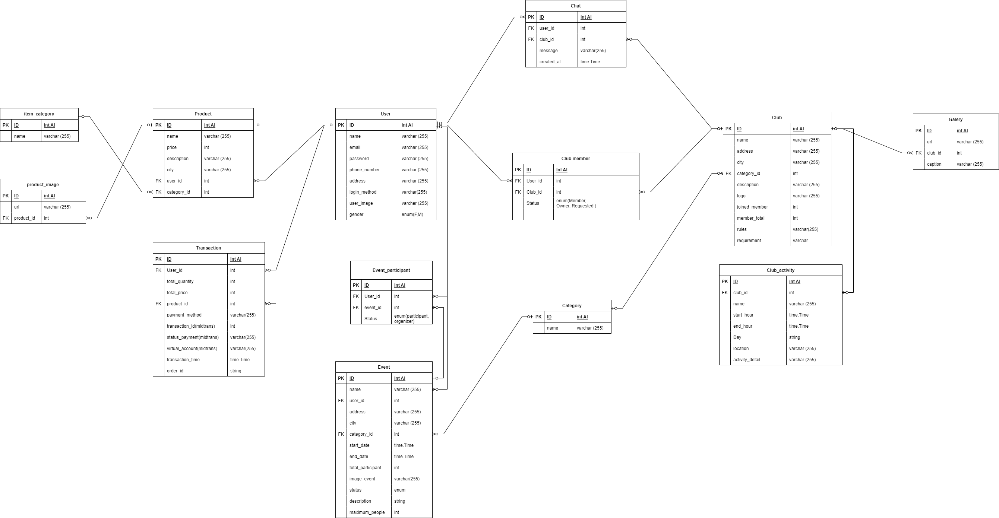

<!-- ABOUT THE PROJECT -->
<br/>
<div align="center">
<!--  mengarah ke repo  -->
  <a href="https://fe-ikuzports-capstone-project-1.vercel.app/">
    
  </a>

  <h3 align="center">Ikuzports Apps</h3>

  <p align="center">
    Capstone Project Alterra Academy Backend Batch 13
    <br />
      <a href="https://github.com/Capstone-Project-Group3-Ikuzports/BE-Ikuzports-CapstoneProject/issues">Report Bug</a>
    ·
       <a href="https://github.com/Capstone-Project-Group3-Ikuzports/BE-Ikuzports-CapstoneProject/issues">Request Feature</a>
    <br />
  </p>
</div>

## 💻 About The Project

Ikuzports is an apps that helps users to carry out hobbies with other people, join an event and join the club. Many of us have a hobby but sometimes we do not have a partner or team to carry it out. This apps will connect every user with other users to carry out hobbies and even create their own club. 

## Feature in Ikuzports

  <!--- feature USER
   --->
<div>
      <details>
<summary>🙎 Users</summary>

In users feature, there are a feature to Create, Read, Update, Delete, Login for users here. You can sign in with your google account as well. 

<div>

- CRUD User
- User can login 
- User can see the event list and the detail of each event
- User can search event by name, sports category and city
- User can join a event, create an event and see their own event
- User can see the club list and the detail of each club
- User can search club by name, sports category and city
- User can join a club, create a club and see their own club
- User can see the activity and galery after join a club
- User can chat with another member of club
- User can see the prouct list in store
- User can search product by name, product category and city
- User can sell and buy product in store
- User can see the history of their transaction

</details>
<div>
      <details>
<summary>👱‍♂️ Guest</summary>

<div>
  
- Guest can see all event in homepage
- Guest can see the list of club
- Guest can see the products in store
- Guest can register 

</details>

<div>
      <details>
<summary>👨‍💻 Users (Club Owner) </summary>

<div>
  
- Club owner can approve member request from user
- Club owner can delete member from their club
- Club owner can create, update or delete club activity
- Club owner can create, update, or delete image in their club

</details>

### 🛠 &nbsp;Build App & Database

<a href="https://code.visualstudio.com/"> </a>
<a href="https://www.mysql.com/"> </a>
<a href="https://go.dev/"> </a>
<a href="https://s3.console.aws.amazon.com/"></a>
<a href="https://hub.docker.com/"></a>
<a href="https://www.cloudflare.com/"></a>
<a href="https://jwt.io/"></a>
<a href="https://swagger.io/"></a>
<a href="https://www.postman.com/"></a>
<a href="https://console.cloud.google.com/"></a>
<a href="https://git-scm.com/"></a>
<a href="https://github.com/"></a>

## 🗃️ ERD



## Open Api

 <a href="https://app.swaggerhub.com/apis-docs/RAMADINAAINIRIZKI/Ikuzports/1.0.0#/"> Click here to redirect to swagger </a>

## Getting Started

### Installation
1. Clone the repo
   ```bash
   git clone https://github.com/Capstone-Project-Group3-Ikuzports/BE-Ikuzports-CapstoneProject.git
   ```
2. Move to project directory:
    ```bash
    cd BE-Ikuzports-CapstoneProject
    ```
3. Create your environment file
    ```bash
    touch .env
    ```
4. Fill environment file
   ```bash
    export DB_USERNAME="YOUR DB USERNAME"
    export DB_PASSWORD="YOUR DB PASSWORD"
    export DB_HOST="YOUR HOST ADDRESS"
    export DB_PORT="3306"
    export DB_NAME="YOUR DB NAME" 
    export SERVER_PORT="YOUR PORT"
    export MIDTRANS_CLIENT_KEY="YOUR MIDTRANS CLIENT KEY"
    export MIDTRANS_SERVER_KEY="YOUR MIDTRANS SERVER KEY"
    export AWS_REGION="YOUR AWS REGION"
    export ACCESS_KEY_IAM="YOUR ACCESS KEY IAM"
    export SECRET_KEY_IAM="YOUR SECRET KEY IAM"
    export AWS_BUCKET_NAME="YOUR AWS BUCKET NAME"
    export EMAIL_FROM="YOUR EMAIL ADDRESS FOR SENDING EMAIL"
    export EMAIL_PASSWORD="YOUR EMAIL PASSWORD FOR SMPT SEND EMAIL"
    export JWT_SECRET="YOU STRING SECRET FOR JWT"
    export GOOGLE_OAUTH_CLIENT_ID="YOUR GOOGLE OAUTH CLIENT ID FOR LOGIN OAUTH"
    " >> .env
   ```
3. Run Project
    ```bash
    source .env && go run main.go
    ```

Contributor :
<br>

[](https://github.com/achmadqizwini)


[](https://github.com/ramadinaainirizqi)
<br>

Mentor :
<br>

[](https://github.com/iffakhry)


<p align="right">(<a href="#top">back to top</a>)</p>
<h3>
<p align="center">:copyright: 2023 | Alterra Academy BE13 :fire:</p>
</h3>